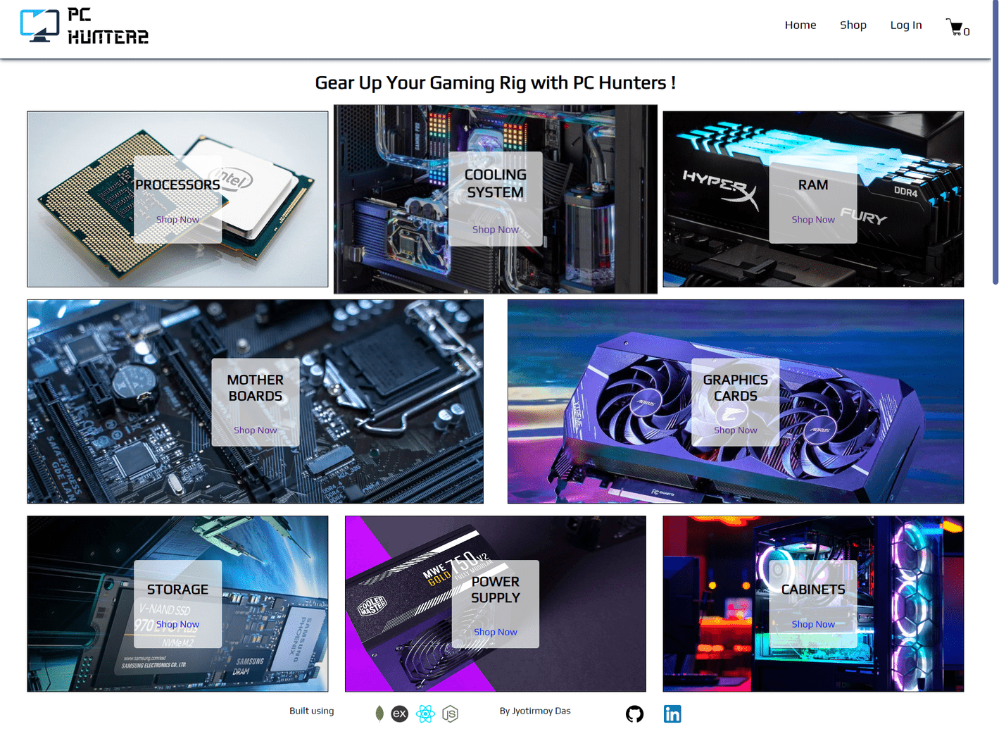
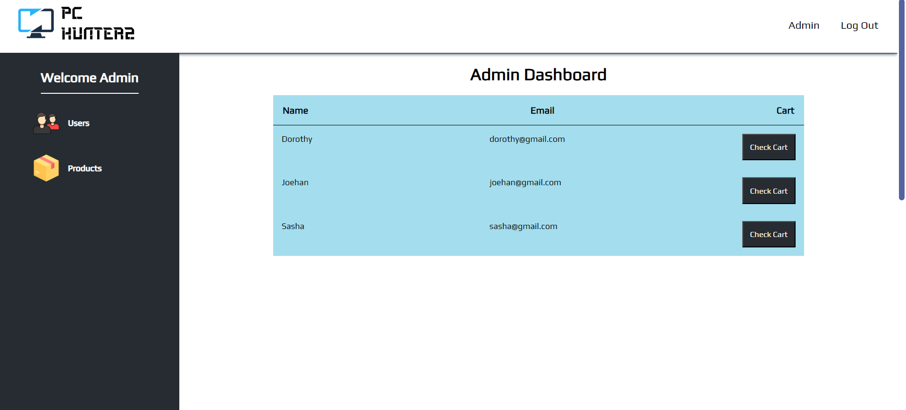

# PC Hunters is a MERN Stack E-Commerce Store Prototype

[https://pc-hunters.netlify.app/](https://pc-hunters.netlify.app/)

## Features
### PC Hunters is a Full Stack E-Commerce Store Prototype built using ReactJS, ExpressJS, and MongoDB. As a computer parts marketplace, users can explore different products ranging from Processors, GPUs to cabinets, add products to their cart and also order products using test credit cards.

* #### Integrated Stripe Payment Gateway.
* #### MongoDB as a No-SQL database to store data.
* #### Added an Admin Dashboard.
* #### Implemented routing using React Router V6.
* #### Used JWT(JSON Web Tokens) to authenticate users.
* #### Used Redux as a state management library.
* #### Used Stripe Webhooks to monitor user payment logs.

## Home Page

## Product Page

## Cart Page

## Admin Dashboard

### Admin can perform CRUD operations on the products and view user carts.